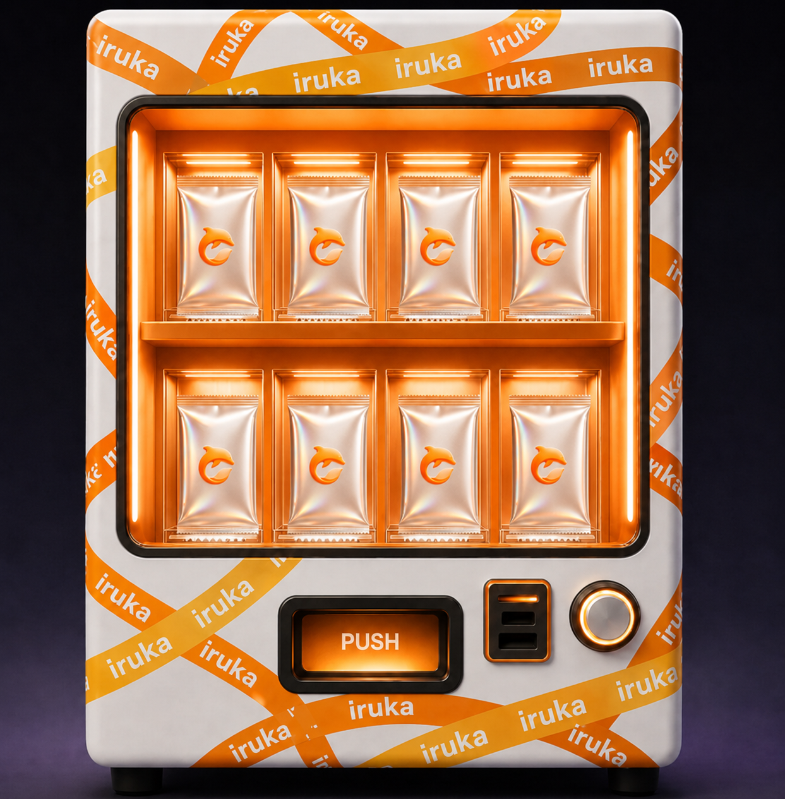
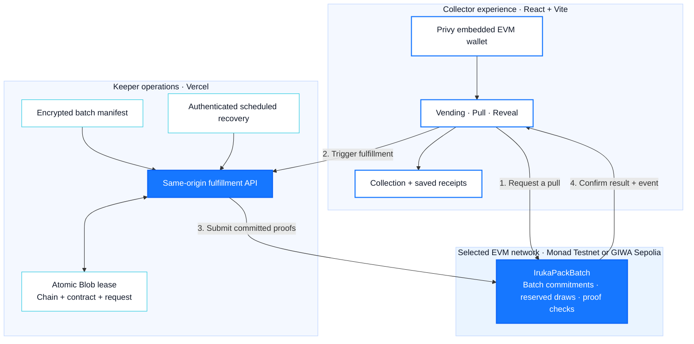

# Iruka

**Collect the moment. Verify the pull.**

A K-pop-first collectible platform built around transparent packs and
verifiable onchain pulls. Iruka connects the excitement of opening a pack with
a result collectors can check, save, and revisit.

[](https://playiruka.space)

[Open Iruka](https://playiruka.space/#pull) ·
[Product docs](https://docs.playiruka.space/overview) ·
[Monad integration](./docs/gitbook/technical/monad-testnet.mdx) ·
[GIWA Contracts](./docs/gitbook/technical/giwa-testnet.mdx)

## The collectible experience

<p align="center">
  
</p>

**Choose a pack → Check the odds → Open → Reveal → Keep the receipt**

| Moment | What the collector gets |
| --- | --- |
| Vending | Pack selection, published rarity odds, batch identity and redemption status |
| Pull | An embedded EVM wallet requests one committed inventory position |
| Reveal | The assigned card appears after the contract result and matching event are confirmed |
| Collection | The card and its request/fulfillment provenance persist, with an Explorer link after reload |

The broader product connects **Vending → Reveal → Vault → Marketplace →
Redemption**. Vault and trading interfaces are present; commercial settlement,
verified physical custody and shipping remain release goals. Test pulls do not
establish physical ownership or redemption rights.

## Why the pull is verifiable

**Rules before purchase. Evidence before reveal. Recovery without repurchase.**

- **Committed batch:** supply, price, inventory root, odds commitment and draw-seed
  root are recorded before the batch opens.
- **Contract-controlled assignment:** each request reserves a draw; only the
  configured Keeper can fulfill it with a valid committed server-seed proof
  and inventory proof.
- **A traceable result:** the browser checks the contract, matching fulfillment
  event and inventory identity before showing the assigned card.
- **A recoverable experience:** pending requests resume using the original request
  ID. Trigger and scheduled recovery share an atomic fulfillment lease.

The current mechanism uses committed server seeds and Merkle proofs. It does
not claim VRF, production randomness assurance or a completed external audit.

## Monad

The Monad integration carries the existing collectible flow onto **Monad
Testnet**, with dedicated configuration, commitments and Keeper operations.
It is the Metropolis submission build, targeting **Consumer Products & Payments**.

| Deployment | Status | Reference |
| --- | --- | --- |
| **Monad Testnet** · `10143` · MON | Code implemented and locally verified; contract deployment and live Pull pending | [Technical status and release gates](./docs/gitbook/technical/monad-testnet.mdx) |
| **GIWA Sepolia** · `91342` · test ETH | Existing source-verified contract and documented successful test pulls; default build | [Contract and receipts](./docs/gitbook/technical/giwa-testnet.mdx) |

The Monad implementation includes:

- Privy wallet configuration, MON balances and native transfers
- Initial Debut batch `IRK-MON-2026-001`: 100 test positions, 0.00001 test MON
- Independent encrypted manifest, fulfillment API, Blob leases and cron recovery
- Bounded fulfillment-event queries for delayed requests on the public RPC
- Saved request and fulfillment receipts, restored through the existing Summary
- Chain-isolated pending requests, transfers and collections

Missing Monad contract configuration disables Pull even in development. No
Monad address or successful live Pull is published yet. The 100 positions are
test records, not 100 verified physical cards. GIWA evidence is kept separate.

## Architecture



One build selects one deployment. Monad and GIWA use independent contracts,
batch secrets, API routes and lease namespaces. Physical custody records and
commercial settlement are outside this testnet contract.

| Layer | Source |
| --- | --- |
| Deployment selection and wallet network | [src/activeDeployment.ts](./src/activeDeployment.ts) |
| Pull, event confirmation and receipt persistence | [src/giwaPull.ts](./src/giwaPull.ts) · [src/giwaFulfillment.ts](./src/giwaFulfillment.ts) · [src/pullReceiptStorage.ts](./src/pullReceiptStorage.ts) |
| Monad fulfillment and recovery | [api/monad](./api/monad) · [server/monad](./server/monad) |
| Contract and operator tooling | [contracts](./contracts) · [scripts/monad](./scripts/monad) |

GIWA-named frontend modules retain compatibility exports and consume the active
deployment descriptor. They also power the Monad flow.

## Run locally

Use Node.js `24.14.0` from [.nvmrc](./.nvmrc), npm, and Foundry for contract work.
Monad contract operations require Foundry **1.8 or later**.

```bash
nvm use
npm ci
cp .env.example .env.local
```

Set `VITE_PRIVY_APP_ID` in `.env.local`; `VITE_PRIVY_CLIENT_ID` is optional.
For the Monad build, set:

```dotenv
VITE_IRUKA_DEPLOYMENT=monad
VITE_MONAD_RPC_URL=https://testnet-rpc.monad.xyz
# Populate with the real contract address after deployment.
VITE_MONAD_PACK_BATCH_ADDRESS=
```

```bash
npm run dev
npm run build
```

The template defaults to GIWA. A complete Monad Pull also needs a deployed and
committed batch, funded Keeper, same-origin API hosting, encrypted manifest,
Blob storage and cron configuration. Server-only environment variables are
listed in [.env.example](./.env.example). Previewing the frontend alone does not
install those services.

## Verification

```bash
npm test
npm run test:contracts
VITE_IRUKA_DEPLOYMENT=giwa npm run build
VITE_IRUKA_DEPLOYMENT=monad npm run build
# Foundry 1.8+
forge test --network monad
```

Tests cover deployment isolation, request/event confirmation, delayed recovery,
receipt restoration, native transfers, existing product flows and contract proof
checks. Local RPC fixtures and contract tests are verification evidence, not
live chain receipts.

## Product status and documentation

The public app supports English and Korean, browsing without sign-in, and
Privy-authenticated account actions. Physical sourcing, verification, custody,
grading and market-value methodology are in validation. ERC-721 ownership,
USDC settlement, commercial trading, redemption, shipping and licensed drops
remain planned.

- [Product scope and policies](./docs/gitbook/overview.mdx)
- [Monad release gates](./docs/gitbook/technical/monad-testnet.mdx)
- [Metropolis submission checklist](./docs/internal/metropolis-submission-2026.md)
- [Repository feature map](./docs/FEATURE_MAP.md)
- Working rules: [AGENTS.md](./AGENTS.md) · [CLAUDE.md](./CLAUDE.md) ·
  [design.md](./design.md) · [sprint.md](./sprint.md)

Mintlify source lives in [docs/gitbook](./docs/gitbook). Preview it with
`mint dev` and validate links with `mint broken-links` from that directory.

## Security

Never commit deployer, Keeper or manifest keys, Privy secrets, or environment
exports. `.env.local`, `.context/` and `.vercel/` are ignored. Server secrets
must never use a `VITE_` prefix: Vite exposes those values to the browser.
