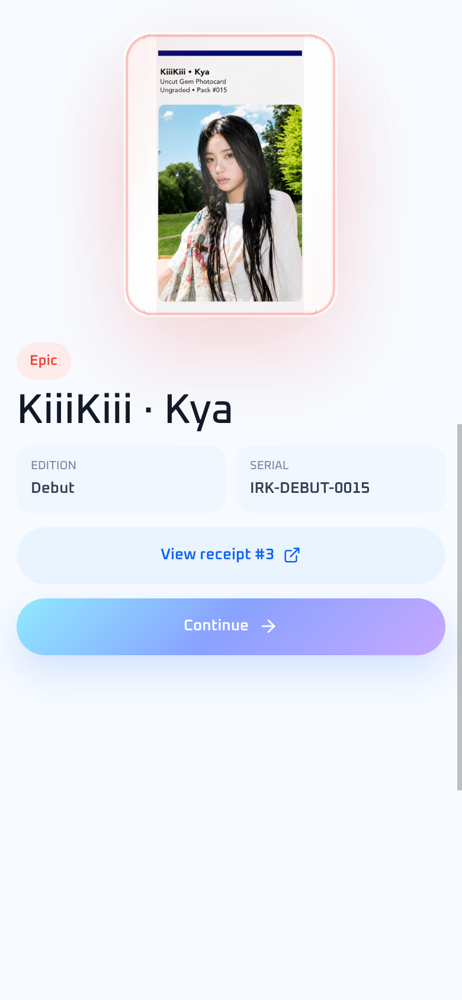

# Monad verification

Iruka's Monad testnet flow has five independently checked live Pulls, browser
interruption recovery, scheduled recovery, and concurrent fulfillment requests.
This report records the October 6, 2026 review. It describes a testnet product;
commercial settlement, custody, redemption and NFT ownership remain planned.

[Try Monad Vending](https://playiruka.space/?network=monad#pull) ·
[Public evidence JSON](./evidence/monad-testnet.json) ·
[Verify workflow](https://github.com/starlash7/iruka/actions/runs/37439556226)

## Tested source and automated checks

Source: [`9108814`](https://github.com/starlash7/iruka/commit/91088149df70fce237b611beb76f5974ff5f438e).
The linked GitHub Actions run passed both jobs on October 6, 2026, including
377 Node tests and both contract modes. The workflow runs on `main`, `monad`
and pull requests.

| Check | Local result |
| --- | --- |
| `npm test` | 377 passed, 0 failed, 0 skipped |
| GIWA-default production build | Passed |
| Monad-default production build | Passed |
| Foundry contract tests | 13 passed |
| Foundry `--network monad` tests | 13 passed |
| Read-only live evidence verifier | 5 requests verified against receipts, events and `getPull` |
| Desktop and 390×844 mobile | Core Pull, Skip, Summary, Continue and saved receipt checked |

The contract suites execute locally; the live evidence below comes from the
actual Monad testnet deployment. They are separate forms of evidence.

```bash
nvm use
npm ci
npm test
VITE_IRUKA_DEPLOYMENT=giwa npm run build
VITE_IRUKA_DEPLOYMENT=monad npm run build
# Foundry 1.8+
forge test
forge test --network monad
```

Builds report a bundle-size warning for wallet/3D dependencies. The warning
does not fail the build; this review does not claim mobile performance benchmarks
or an external security audit.

## Verify the live receipts yourself

This command needs Node, installed dependencies and a public Monad RPC. It uses
no wallet, signing key, faucet funds, private manifest or Iruka account.

```bash
node --experimental-strip-types scripts/monad/verify-live-evidence.mjs
```

An alternative public endpoint can be supplied with `MONAD_TESTNET_RPC_URL`.
The verifier checks chain ID, deployed code, successful setup receipts, batch
supply/price/roots, each request and fulfillment receipt, event identities,
reserved draw, canonical `getPull`, unique inventory assignment, and the exact sender, recipient and value of the native transfer. It exits
with an error if recorded evidence and chain data disagree.

The observed result at 08:52:57 UTC was:

```json
{
  "status": "verified",
  "chainId": 10143,
  "verifiedPulls": 5,
  "available": 95,
  "remaining": 95,
  "nextDrawIndex": 5,
  "nextFulfillIndex": 5
}
```

The remaining supply is a timestamped snapshot. Later legitimate Pulls change
counters; a rerun reports the current values.

## Live Monad evidence

Contract: [`0x51fb…12c0`](https://testnet.monadvision.com/address/0x51fbe474cb6e614dd5a47d3c93486028270212c0),
source verified. Batch `IRK-MON-2026-001` committed 100 test positions at
0.00001 test MON. These positions are not 100 proven physical cards.

| Pull | Scenario | Request | Fulfillment | Inventory index |
| --- | --- | --- | --- | --- |
| #1 | Browser Pull, saved result, refresh | [Receipt](https://testnet.monadvision.com/tx/0x47c1e60418ffb23c57432893d03291e0b2c3e59b381ca6a1c1cc920084c50caf) | [Receipt](https://testnet.monadvision.com/tx/0x364ac9fc19a48e672512d5d82333e475976d27d0910f42960a93cc79283b663a) | 84 |
| #2 | Scheduled recovery, no browser trigger | [Receipt](https://testnet.monadvision.com/tx/0xf8afc2634116c4506424e91df1e5eda9bbab6d72927f53e6b6c005b28f10d71e) | [Receipt](https://testnet.monadvision.com/tx/0x83cfd2fa71e6609c7fd52de73e3aa6b423b931bf60cb3ff200d2ecf7677d617a) | 56 |
| #3 | Browser interruption and Resume | [Receipt](https://testnet.monadvision.com/tx/0x4d8ab616d2337dc6a9914e2b771423ca1ce3eb87b6c83486be7bfb110eb915e9) | [Receipt](https://testnet.monadvision.com/tx/0x6849a30f107c6f6110c94c31f08051151d48a74088b2d086f15524f4b85b1b69) | 14 |
| #4 | Concurrent HTTP fulfillment triggers | [Receipt](https://testnet.monadvision.com/tx/0xf8c6d3733f1130c12ced4229bfb3f815fc22dd4b8f1cbc75d564a2e7afb5085e) | [Receipt](https://testnet.monadvision.com/tx/0x4c8769a3783801c4729bcab00ad13e4349b381895eee68d4beb1b540875e8fc9) | 32 |
| #5 | Queued draw with concurrent triggers | [Receipt](https://testnet.monadvision.com/tx/0x791ea4554835b6c8764ceec26d8b37d24fd914233b91e79e94240df8778b4745) | [Receipt](https://testnet.monadvision.com/tx/0x94ff63d01bec7e0d52821df55e2ac1ee7b66b0257523d87f6476e3230c6edc27) | 37 |

### Scheduled recovery

An isolated test wallet submitted #2 without calling `/api/monad/fulfill` or
`/api/monad/recover`. The production request log recorded:

```text
2026-10-06T08:02:50.154Z  GET /api/monad/recover  200
```

The matching fulfillment was observed by 08:02:56 UTC, about 21 seconds after
request confirmation. The sanitized observation is in the evidence JSON.
Receipts prove chain execution; the request log and test procedure establish
the scheduled-recovery scenario.

### Browser interruption and saved receipt

For #3, the browser refreshed immediately after wallet submission, before
request confirmation finished in the app. The restored app displayed
`Resume opening`. Resuming required no second wallet approval and used request
#3. Skip opened Summary with **KiiiKiii · Kya**, Epic, `IRK-DEBUT-0015`.
Continue saved it; a second refresh and reopening Account restored the same
fulfillment receipt. The observer performed these steps through the browser UI.

<p align="center">
  
</p>

GIWA retained its separate one-card collection and ETH balance; Monad retained
two browser-collected cards and a MON balance. Isolated test-wallet requests did
not appear in the browser collector's inventory.

### Concurrent API requests

Two isolated test-wallet requests (#4 and #5) received eight simultaneous
same-origin HTTP triggers, four per request. Seven returned `202 pending`;
one returned `200 submitted` for #4. #5 initially reported that its preceding
draw was still pending, then fulfilled after the preceding draw.

Each request has exactly one matching fulfillment event. Inventory indices
32 and 37 differ; the final draw/fulfillment counters were both 5. This is a
live concurrency check, not a throughput/load benchmark.

### Native MON withdrawal

The browser cancelled Privy approval, returned to the original form with its
inputs intact, retried, and successfully withdrew **0.001 test MON** to an
isolated test wallet. Iruka displayed `Transfer complete`, the correct receipt,
and the updated MON balance; refresh preserved the balance and collection.

[Withdrawal receipt](https://testnet.monadvision.com/tx/0xb26aeb9de8d9c8ce43a43b48eee46049174d65eca8067f408f9f5228075421aa) ·
[Sanitized transfer evidence](./evidence/monad-native-transfer.json)

This check found and fixed a native-dialog/Privy-portal conflict: the native
Withdraw dialog now releases its top layer before requesting wallet approval,
then reopens on completion or rejection. A synchronous account guard prevents
another deposit/withdrawal from starting before the first transaction hash.
The funding wallet picker also closes the native funding dialog before opening
Privy selection, so the selection portal remains accessible. The public verifier also checks the successful receipt, chain, sender,
recipient and exact transferred value. Only test MON was transferred.

## Failure and recovery coverage

| Case | Evidence |
| --- | --- |
| Twenty simultaneous fresh/stale lease acquisitions | Actual lease functions with an in-memory external Blob adapter; exactly one owner |
| Stale owner renews/deletes replacement lease | ETag fencing tests; replacement survives |
| Lease lost before broadcast | Zero sends; replacement owner retained |
| Browser and scheduled recovery overlap | Executable ordered/deduplicated fulfillment regression |
| Never-settling RPC read | Deadline returns pending; actual HTTP cancellation tested |
| Interrupted historical log scan | Completed pages retained for Resume; unfinished page retried |
| Wrong collector, batch, draw, inventory or event | Actual viem HTTP/ABI tests reject mismatches |
| Bigint request IDs and inclusive 100-block limits | Boundary and final-window RPC tests |
| Missing event/hash or failed RPC | No invented fulfillment receipt |
| Collection storage quota or denied browser storage | Save acknowledgment preserves pending recovery; getter failures caught |
| Logout/wallet change during deferred Pull | Deferred session-guard tests reject stale continuations; App cleanup reviewed |
| Overlapping deposit/withdraw before a transaction hash | Real AccountView handler tests with deferred wallet switch; busy controls reviewed in browser |
| Native Withdraw approval, cancel and retry | Actual browser transfer and independently checked receipt |
| Invalid recipient, zero/negative/overprecision amount | Transfer validation regressions and browser form check |
| Wrong method / invalid request / foreign origin / unauthenticated recovery | Live HTTP responses 405 / 400 / 403 / 401 |
| Temporary browser RPC outage | Pull disabled during outage; automatically recovered without refresh |

The scan cursor is bounded and in memory. Reload restarts a safe scan. This is
not an archival indexer; a long-delayed request can require several Resume
attempts. Every successful result still needs canonical state and matching
chain evidence. Storage-denied browsers cannot promise persistence across
reloads; pending records are retained whenever storage remains available.

## Run your own full stack

Frontend-only setup is in the [README](../README.md). To reproduce a complete
independent deployment, use a fresh project/contract and your own secrets. The
original private manifest and its key are not needed for automated tests or
read-only verification.

1. Fund separate deployer and Keeper wallets with test MON. Configure an ignored
   environment file with `MONAD_DEPLOYER_PRIVATE_KEY`, `MONAD_KEEPER_PRIVATE_KEY`,
   `IRUKA_MONAD_KEEPER_ADDRESS` and `MONAD_TESTNET_RPC_URL`.
2. Set `MONAD_BATCH_MANIFEST_KEY` to a base64-encoded 32-byte key. Generate a new
   manifest; it contains independently generated draw seeds.

```bash
node scripts/monad/prepare-batch.mjs IRK-MON-2026-001 100 10000000000000 \
  scripts/monad/debut-odds.json .context/fresh-debut.json debut
node --env-file=.context/own-monad.env scripts/monad/encrypt-manifest.mjs \
  .context/fresh-debut.json .context/fresh-debut.json.enc
node --env-file=.context/own-monad.env scripts/monad/deploy-pack-batch.mjs
```

3. Record the printed deployment hash/address, add your address as
   `MONAD_PACK_BATCH_ADDRESS` and `VITE_MONAD_PACK_BATCH_ADDRESS`, then commit
   your new batch:

```bash
node --env-file=.context/own-monad.env scripts/monad/commit-batch.mjs \
  .context/fresh-debut.json YOUR_DEPLOYMENT_TRANSACTION_HASH
```

4. Package your own ciphertext at `server/monad/manifests/debut.json.enc` in the
   fresh checkout/deployment. The encrypt command refuses to overwrite an
   existing destination; generate a new output before replacing that package.
5. Set server-only Keeper/manifest secrets, a private `BLOB_READ_WRITE_TOKEN`,
   `CRON_SECRET` of at least 16 characters, and the exact HTTPS
   `MONAD_APP_ORIGIN`. Configure the frontend address/RPC and a Privy project
   allowing your deployed origin.
6. Deploy APIs and frontend together using `vercel.json`. Its recovery crons run every minute; the GIWA cron needs separate GIWA
   configuration if retained in the fresh project. Fund the embedded collector wallet and open
   `?network=monad#pull`; inspect the request and fulfillment on the explorer.

Recovery currently operates the initial Debut batch, one queued request per
cron invocation. Additional batches require request resolution from events.
No VRF, gas sponsorship, seedless/passkey account or mainnet claim is made.

## Submission status

The public source, MIT license, attribution, AI/pre-existing-work disclosure,
live deployment and transaction evidence are present. Required demo/pitch video
URLs and final submission are still outstanding in the
[submission checklist](./internal/metropolis-submission-2026.md).
Eligibility and judging remain with the organizers.
